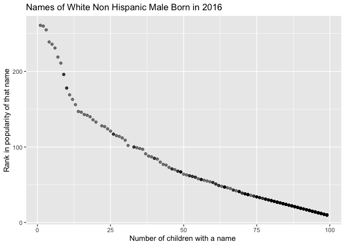

p8105\_hw2\_xw2757
================

``` r
library(tidyverse)
```

    ## ── Attaching packages ─────────────────────────────────────── tidyverse 1.3.1 ──

    ## ✓ ggplot2 3.3.5     ✓ purrr   0.3.4
    ## ✓ tibble  3.1.4     ✓ dplyr   1.0.7
    ## ✓ tidyr   1.1.3     ✓ stringr 1.4.0
    ## ✓ readr   2.0.1     ✓ forcats 0.5.1

    ## ── Conflicts ────────────────────────────────────────── tidyverse_conflicts() ──
    ## x dplyr::filter() masks stats::filter()
    ## x dplyr::lag()    masks stats::lag()

``` r
library(readxl)
```

\#\#Problem 1 **Loading and cleaning data**

``` r
mtw_df <- 
  read_excel("TW_data.xlsx", sheet = "Mr. Trash Wheel", skip = 1, ) %>% 
  janitor::clean_names() %>% 
  filter(dumpster != "" , dumpster != "Grand Total") %>% 
  select(dumpster:homes_powered) %>% 
  mutate(month = factor(month), year = factor(year), dumpster = as.numeric(dumpster), sports_balls = round(sports_balls, digit = 0))
```

    ## New names:
    ## * `` -> ...15
    ## * `` -> ...16
    ## * `` -> ...17

``` r
p2019_df <- 
  read_excel("TW_data.xlsx", sheet = "2019 Precipitation", skip = 1, ) %>% 
  janitor::clean_names() %>% 
  na.omit() %>% 
  mutate(year = "2019") %>% 
  rename(prcp = total)

p2018_df <- 
  read_excel("TW_data.xlsx", sheet = "2018 Precipitation", skip = 1, ) %>% 
  janitor::clean_names() %>% 
  na.omit() %>% 
  mutate(year = "2018") %>% 
  rename(prcp = total)

prcp_df <-  
  bind_rows(p2018_df, p2019_df)

prcp_df %>% 
  mutate(month = month.name[month])
```

    ## # A tibble: 24 × 3
    ##    month      prcp year 
    ##    <chr>     <dbl> <chr>
    ##  1 January    0.94 2018 
    ##  2 February   4.8  2018 
    ##  3 March      2.69 2018 
    ##  4 April      4.69 2018 
    ##  5 May        9.27 2018 
    ##  6 June       4.77 2018 
    ##  7 July      10.2  2018 
    ##  8 August     6.45 2018 
    ##  9 September 10.5  2018 
    ## 10 October    2.12 2018 
    ## # … with 14 more rows

**Describing data** In data set “Mr. Trash Wheel”, the variables
descirbed are as followed: dumpster, month, year, date, weight\_tons,
volume\_cubic\_yards, plastic\_bottles, polystyrene, cigarette\_butts,
glass\_bottles, grocery\_bags, chip\_bags, sports\_balls,
homes\_powered. There is a total number of 453 from the following years:
2014, 2015, 2016, 2017, 2018, 2019, 2020, 2021. Of all the trash
categories, total number of sports balls picked up is 5321, the mean
number is 11.7461369, and the median is 9.

In precipitation data set, there are a total of 24 observations. The
mean precipitation in 2018 is 5.8608333, and the median is 5.455. The
mean precipitation in 2019 is 2.8291667, and the median is 3.335. Total
precipitation in 2018 is 70.33.

\#\#Problem 2

**Importing and merging data**

``` r
pols_month <- 
  read_csv(file = "fivethirtyeight_datasets/pols-month.csv") %>% 
  separate(mon, c("year", "month", "day"), sep = "-" , convert = TRUE) %>% 
  mutate(month = month.abb[month], 
         president = ifelse(prez_dem == 1, "dem", "gop")) %>% 
  select(-day, -prez_dem, -prez_gop)
```

    ## Rows: 822 Columns: 9

    ## ── Column specification ────────────────────────────────────────────────────────
    ## Delimiter: ","
    ## dbl  (8): prez_gop, gov_gop, sen_gop, rep_gop, prez_dem, gov_dem, sen_dem, r...
    ## date (1): mon

    ## 
    ## ℹ Use `spec()` to retrieve the full column specification for this data.
    ## ℹ Specify the column types or set `show_col_types = FALSE` to quiet this message.

``` r
snp <- 
  read_csv(file = "fivethirtyeight_datasets/snp.csv") %>% 
  separate(date, c("month", "day", "year"), sep = "/") %>% 
  mutate(year = ifelse(year <= "15" ,  paste0("20", year), paste0("19", year)), month = as.numeric(month)) %>% 
  arrange(year, month) %>% 
  mutate(month = month.abb[month], year = as.numeric(year)) %>% 
  select(-day)
```

    ## Rows: 787 Columns: 2

    ## ── Column specification ────────────────────────────────────────────────────────
    ## Delimiter: ","
    ## chr (1): date
    ## dbl (1): close

    ## 
    ## ℹ Use `spec()` to retrieve the full column specification for this data.
    ## ℹ Specify the column types or set `show_col_types = FALSE` to quiet this message.

``` r
unemply <- 
  read_csv(file = "fivethirtyeight_datasets/unemployment.csv") %>% 
  pivot_longer(Jan:Dec, names_to = "month", values_to = "unemployment")
```

    ## Rows: 68 Columns: 13

    ## ── Column specification ────────────────────────────────────────────────────────
    ## Delimiter: ","
    ## dbl (13): Year, Jan, Feb, Mar, Apr, May, Jun, Jul, Aug, Sep, Oct, Nov, Dec

    ## 
    ## ℹ Use `spec()` to retrieve the full column specification for this data.
    ## ℹ Specify the column types or set `show_col_types = FALSE` to quiet this message.

``` r
snp_pols <- 
  left_join(pols_month, snp, by = c("year" = "year" , "month" = "month"))

full_df <- 
  left_join(snp_pols, unemply, by = c("year" = "Year" , "month" = "month"))
```

The data set “full\_df” describes informations compiled from data sets
“snp”, “unemply”, and “pols\_month”. There are a total of 822
observations. “snp” contains information on S&P close number. “unemply”
contains employment rate. “pols\_month” contains information on the dem
and gop number of representatives. The final data set contains data from
year 1947 to 2015.

\#\#Probelm 3 **Import data**

``` r
baby_names <- 
  read_csv(file = "Popular_Baby_Names.csv", col_type = "fffcii") %>% 
  janitor::clean_names() %>% 
   mutate(ethnicity = replace(ethnicity, ethnicity == "ASIAN AND PACIFIC ISLANDER", "ASIAN AND PACI"),
         ethnicity = replace(ethnicity, ethnicity == "BLACK NON HISPANIC", "BLACK NON HISP"),
         ethnicity = replace(ethnicity, ethnicity == "WHITE NON HISPANIC", "WHITE NON HISP"),
         childs_first_name = str_to_lower(childs_first_name)) %>% 
  distinct(childs_first_name, year_of_birth,ethnicity, .keep_all = TRUE)
```

**Olivia Ranking**

``` r
olivia_rank <- 
  filter(baby_names, childs_first_name == "olivia") %>%
  select(year_of_birth, gender, ethnicity, rank ) %>% 
  pivot_wider(names_from = "year_of_birth", values_from = "rank")

olivia_rank
```

    ## # A tibble: 4 × 8
    ##   gender ethnicity      `2016` `2015` `2014` `2013` `2012` `2011`
    ##   <fct>  <fct>           <int>  <int>  <int>  <int>  <int>  <int>
    ## 1 FEMALE ASIAN AND PACI      1      1      1      3      3      4
    ## 2 FEMALE BLACK NON HISP      8      4      8      6      8     10
    ## 3 FEMALE HISPANIC           13     16     16     22     22     18
    ## 4 FEMALE WHITE NON HISP      1      1      1      1      4      2

**Male name over time**

``` r
male_rank <- 
  filter(baby_names, gender == "MALE") %>% 
  select(year_of_birth, ethnicity, childs_first_name, rank) %>% 
  pivot_wider(names_from = "year_of_birth", values_from = "rank")
  
male_rank
```

    ## # A tibble: 1,402 × 8
    ##    ethnicity      childs_first_name `2016` `2015` `2014` `2013` `2012` `2011`
    ##    <fct>          <chr>              <int>  <int>  <int>  <int>  <int>  <int>
    ##  1 ASIAN AND PACI ethan                  1      2      2      2      2      1
    ##  2 ASIAN AND PACI ryan                   2      3      3      3      1      3
    ##  3 ASIAN AND PACI muhammad               3      4      6      6      7     11
    ##  4 ASIAN AND PACI lucas                  4      6      4      4      3      5
    ##  5 ASIAN AND PACI jayden                 5      1      1      1      2      2
    ##  6 ASIAN AND PACI aiden                  6      5      5      5      6      7
    ##  7 ASIAN AND PACI daniel                 7     16      7      7      9     10
    ##  8 ASIAN AND PACI evan                   8      8     11     14     13     19
    ##  9 ASIAN AND PACI jason                  9      8     10      9      8      6
    ## 10 ASIAN AND PACI liam                   9      9     16     10     29     41
    ## # … with 1,392 more rows

**scatter plot**

``` r
wtnonhisp_2016 <- 
  filter(baby_names, ethnicity == "WHITE NON HISP", gender == "MALE", year_of_birth == "2016") %>% 
  select(year_of_birth, childs_first_name, count, rank )

wtnonhisp_2016_plot <- 
wtnonhisp_2016 %>% 
  ggplot(aes(x = rank, y = count)) +
  geom_point(alpha = .5) + 
  labs(
    title = "Names of White Non Hispanic Male Born in 2016",
    x = "Number of children with a name ",
    y = "Rank in popularity of that name"
  )

wtnonhisp_2016_plot
```

<!-- -->
